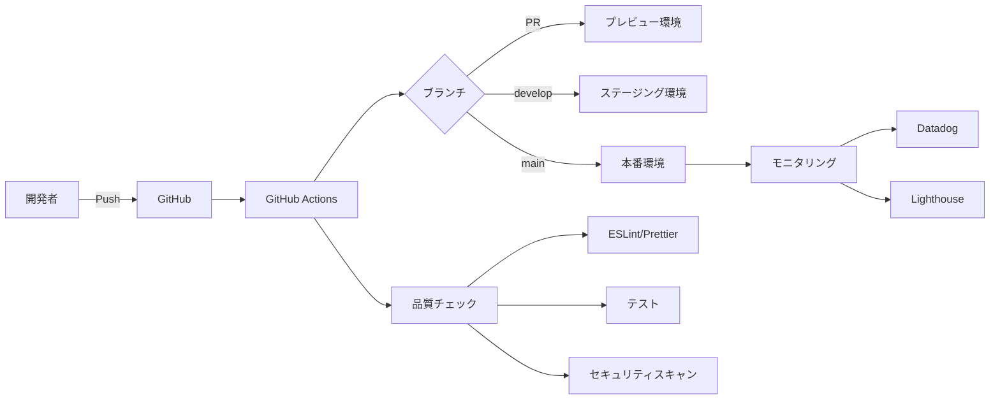

# BEE ART ENA CI/CD パイプライン

## 概要

このドキュメントでは、BEE ART ENAプロジェクトのCI/CDパイプラインについて説明します。

## アーキテクチャ



## パイプラインステージ

### 1. コード品質チェック
- **ESLint**: コード規約の遵守
- **Prettier**: コードフォーマット
- **TypeScript**: 型チェック
- **console.log検出**: 本番コードからの除去

### 2. セキュリティスキャン
- **npm audit**: 依存関係の脆弱性チェック
- **Snyk**: 継続的なセキュリティモニタリング
- **TruffleHog**: シークレット検出
- **Semgrep**: 静的コード解析

### 3. テスト
- **単体テスト**: Jest
- **統合テスト**: Jest + Testing Library
- **E2Eテスト**: Playwright（Chrome, Firefox, Safari）
- **パフォーマンステスト**: k6
- **アクセシビリティテスト**: axe-core

### 4. ビルド
- **Next.js最適化ビルド**
- **バンドルサイズ分析**
- **環境変数の注入**
- **アーティファクトの保存**

### 5. デプロイメント

#### プレビュー環境（PR）
- 自動デプロイ
- PR コメントにURLを投稿
- Lighthouse CI実行

#### ステージング環境（develop）
- 自動デプロイ
- スモークテスト実行
- Slack通知

#### 本番環境（main）
- 承認必須
- バックアップタグ作成
- スモークテスト実行
- リリース作成
- Slack通知

## 環境変数

### 必須のシークレット

```bash
# Vercel
VERCEL_TOKEN
VERCEL_ORG_ID
VERCEL_PROJECT_ID

# Firebase
STAGING_FIREBASE_CONFIG
PRODUCTION_FIREBASE_CONFIG

# API
STAGING_API_URL
PRODUCTION_API_URL

# モニタリング
CODECOV_TOKEN
SNYK_TOKEN
SONAR_TOKEN
DATADOG_API_KEY

# 通知
SLACK_WEBHOOK
PAGERDUTY_INTEGRATION_KEY
```

## デプロイメントフロー

### 通常のデプロイ

1. 開発者がfeatureブランチで作業
2. PRを作成 → プレビュー環境に自動デプロイ
3. レビュー承認後、developにマージ → ステージング環境に自動デプロイ
4. テスト完了後、mainにマージ → 本番環境に手動デプロイ（承認必須）

### ホットフィックス

1. mainから直接hotfixブランチを作成
2. 修正実装
3. mainへのPRを作成
4. 緊急承認後、本番デプロイ

## ロールバック手順

### 自動ロールバック

```bash
# GitHub Actionsから実行
1. Actions → Rollback Deployment を選択
2. 環境とバージョンを指定
3. ロールバック理由を入力
4. 実行
```

### 手動ロールバック

```bash
# 前のバージョンをチェックアウト
git checkout v123

# ビルドとデプロイ
npm ci
npm run build
vercel deploy --prod
```

## モニタリング

### メトリクス

- **エラー率**: 5%以上でアラート
- **応答時間**: 95パーセンタイルで1秒以上でアラート
- **メモリ使用率**: 85%以上で警告
- **CPU使用率**: 90%以上で緊急アラート

### ダッシュボード

1. **Datadog**: リアルタイムメトリクス
2. **Lighthouse**: パフォーマンス推移
3. **Codecov**: コードカバレッジ
4. **SonarCloud**: コード品質

## トラブルシューティング

### ビルドエラー

```bash
# キャッシュクリア
npm ci --force

# 環境変数確認
printenv | grep NEXT_PUBLIC
```

### デプロイエラー

```bash
# Vercel CLIで直接デプロイ
vercel --token=$VERCEL_TOKEN

# ログ確認
vercel logs
```

### テスト失敗

```bash
# ローカルで再現
npm test
npm run test:e2e

# 特定のテストのみ実行
npm test -- --testNamePattern="特定のテスト"
```

## ベストプラクティス

1. **コミットメッセージ**: Conventional Commitsに従う
2. **PR**: テンプレートを使用し、詳細な説明を記載
3. **テスト**: 新機能には必ずテストを追加
4. **レビュー**: 最低1名の承認が必要
5. **デプロイ**: 営業時間内に実施
6. **モニタリング**: デプロイ後30分は監視

## 連絡先

- **DevOps チーム**: devops@beeartena.com
- **緊急連絡**: oncall@beeartena.com
- **Slack**: #beeartena-devops